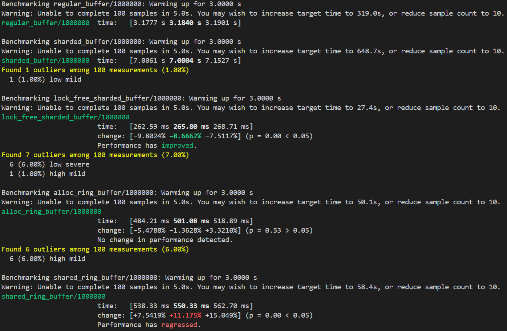

# Generic-Ring-Buffer-Data-Structures
This repository contains implementations of generic ring buffer data structures in Rust (const generic type/regular generics of multithreaded version of ring buffer)

# What Does This Repository Have
Overall, the ring buffers that this repository contains are the following:
- Constant Generic Ring Buffer: `ConstMultiThreadedRingBuffer<T, const CAPACITY: usize>`
    - This ring buffer allocates space for the array on the stack; it's not very useful once there are 100k items because it can't store all that space inside the array. Because it's a const type buffer, all of its operations and methods are synchronous (every other ring buffer in this repo is async though!).
- Multithreaded Ring Buffer: `MultiThreadedRingBuffer<T>`
    - This ring buffer uses a `Box<[Option<T>]>` underneath the hood, which allocates on the heap. It can handle a much larger array of items and it uses Tokio's Mutex locks, and Notify to handle enqueuing and dequeuing items appropriately among multiple enquerer/dequerer threads.
- Sharded Multithread Ring Buffer: `ShardedMultiThreadedRingBuffer<T>`
    - This ring buffer utilizes multiple `Box<[Option<T>]>` underneath the hood to provide the effect of sharding the ringbuffer. Instead of threads having to lock, perform its enqueue/dequeue operation, and then unlock for other threads to perform its operation, it locks a specific shard in to enqueue or dequeue on.
    - Lots of considerations was placed into the design of this sharded ring buffer. For example
        - Using thread local variables with a random initial shard index. This reduces initial contention between threads on acquiring a shard and it allows each thread to recall the next shard index they should check on whether it can be enqueued/dequeued. Doing so allows the threads to traverse through the shards in the `shard_jobs` in a ringbuffer-like manner, potentially exploiting cache locality.
        - Exponential backoff + random jitter is used in acquiring a shard in case of contention being high between threads and CPU usage needs to be yielded from the `acquire_shard` function.
    - Note: Because this is my first attempt on doing a sharded ring buffer, there is definitely some unnecessary locking and synchronization being performed such that it incurs high cost; I wouldn't recommend using this buffer at all.
- Lock Free Sharded Multithreaded Ring Buffer: `LFShardedMultiThreadedRingBuffer<T>`
    - This ring buffer utilizes multiple `Box<[UnsafeCell<Option<T>>]>` underneath the hood. The design of thsi buffer is much simpler than the previous iteration of the sharded mulithreaded ring buffer It is completely lock-free (no mutexes, no rwlock, etc.) and only uses atomic primitives for synchronization purposes. The usage of `UnsafeCell` is done with confidence that only one thread acquires a specific shard and can modify a certain entry inside that shard.
    - Besides using atomic primitives, some other modifications made to this lock free sharded ring buffer are:
        - Applying `#[repr(align(64))]` to the elements in `shard_jobs` field to prevent cache line bouncing between cores; I realized my intention of enabling cache locality using thread local variables might not be possible due to threads existing on different CPU cores and the cost of transferring cache line (if multiple threads across different cores were to modify something existing on the same cache line) between different processor cache might incur slightly more cost. *As of June 22, 2025 this was changed to using `crossbeam_utils` `CachePadded` struct to provide architecture dependent cache padding*
        - Use fastrand instead of rand crate because I don't need a cryptographically secure random range value for a shard index and random jittering.

# Benchmarking
Omitting the `ConstMultiThreadedRingBuffer<T, const CAPACITY: usize>` buffer because it can't handle more than 100,000 items, all the ring buffers + `AllocRingBuffer` from `ringbuffer` crate and `SharedRb` from `ringbuf` crate were timed (see implementation in `rb_benchmarks.rs`) to see the difference on how fast each ring buffer design is. The following is the results outputted by `cargo bench`:

The results seem promising in that my lock free sharded ring buffer implementation much faster than `AllocRingBuffer` from `ringbuffer` crate and `SharedRb` from `ringbuf` crate. However, I want to note that `AllocRingBuffer` is not thread safe and requires a mutex to ensure that enqueuing and dequeuing operations are performed without any issues. As for `SharedRb` it does not necessarily require a mutex, but it's designed as a SPSC (single producer, single consumer) ring buffer, so multiple enquerer and dequerer threads using this structure needs a mutex for locking from my understanding. My lock free sharded ring buffer is MPMC by design, which on further notice half the threads (running with 16 threads) are enqueuing 1000000 items, the other half are dequeuing 1000000 items. In that case, it's actually 8000000 total items being enqueued, which comes down to handling a load of a little over 30 million items per second. 

I think good crates I should compare results with are `concurrent-queue` and `crossbeam`, which I'll do in the future.

# Testing
Admittedly, I haven't created very thorough and exhaustive test cases that verifies the design of my ring buffers and ensures that they are bug-free. I'll get around to them in the future, but I'm pretty confident that my lock free sharded ring buffer is strongly implemented.

# In Conclusion
I had a lot of fun working out these various different MPMC ring buffer structs. Synchronization, sharding, cache optimization techniques, memory ordering (especially with how relevant it is to atomic primitives load and stores), and multithreading/concurrent work all fascinates me, so learning all about that through these ring buffer structures (and in Rust!) really felt rewarding to me. I even got to learn about benchmarking and writing integration test scripts in Rust (through `benches/` and `tests/`), though I have yet to be exhaustive with my integration test scripts and hook it up to GitHub Workflow.